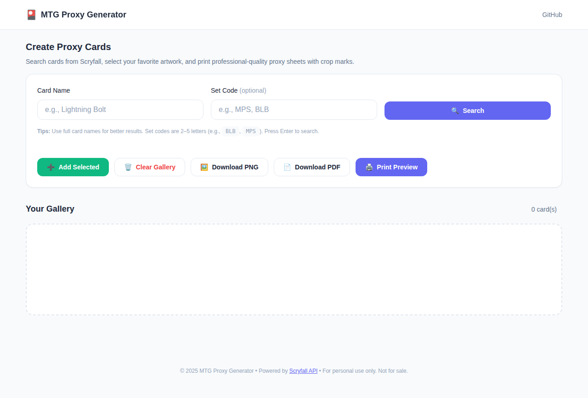
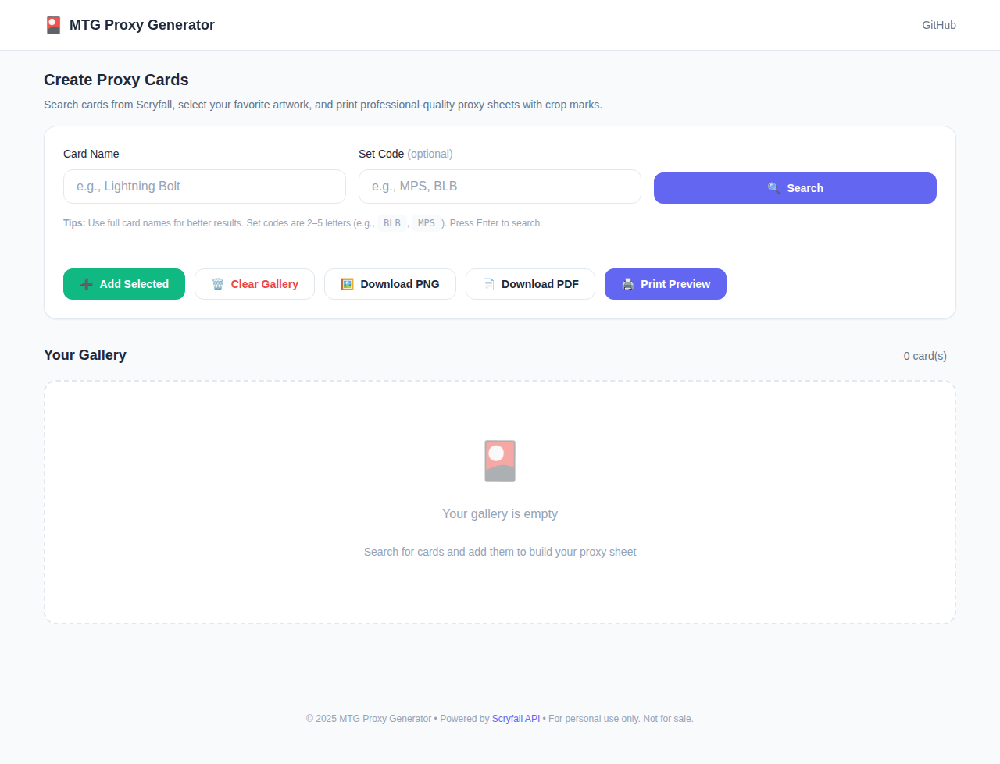
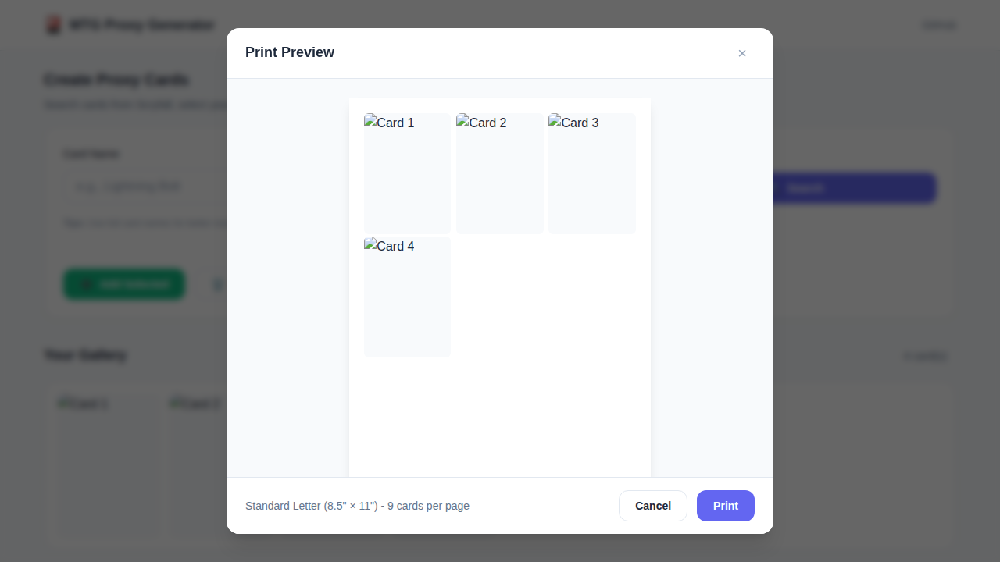

# 🎴 MTG Proxy Generator

> **TCG Proxy Generator powered by the Scryfall API** — A polished, developer-quality web tool for generating printable Magic: The Gathering proxies.



## ✨ Features

- 🔍 **Smart Card Search** — Search Scryfall's extensive card database with debounced input
- 🎨 **Visual Selection** — Click-to-select cards with smooth animations and visual feedback
- 🖨️ **Print Preview** — Preview your proxy sheet before printing with an elegant modal
- 💾 **Auto-Save Gallery** — Your card collection persists across browser sessions
- 📱 **Responsive Design** — Works beautifully on desktop, tablet, and mobile
- 📄 **Export Options** — Download as PNG or PDF, or print directly

## 🚀 What This Project Demonstrates

This project showcases modern front-end engineering practices:

### API Integration
- RESTful API consumption with the [Scryfall API](https://scryfall.com/docs/api)
- Debounced search input for optimal API usage
- Comprehensive error handling with user-friendly notifications
- Support for double-faced cards and various card layouts

### State Management
- Centralized application state with clean component architecture
- LocalStorage persistence for gallery data
- Event-driven updates with callback patterns

### Print Layout Engineering
- Precise 2.5" × 3.5" card dimensions (standard MTG size)
- 3×3 grid optimized for Letter (8.5" × 11") paper
- CSS print media queries for clean output
- PDF generation with proper margins and scaling

### Front-End Architecture
- ES Modules for clean code organization (`/src` structure)
- CSS custom properties (variables) for theming
- Component-based design patterns
- ESLint + Prettier for code quality

## 📦 Project Structure

```
mtg-proxy-generator/
├── index.html              # Main HTML entry point
├── src/
│   ├── app.js              # Main application logic
│   ├── api/
│   │   └── scryfall.js     # Scryfall API integration
│   ├── components/
│   │   ├── gallery.js      # Card gallery component
│   │   ├── searchResults.js # Search results component
│   │   ├── loader.js       # Loading spinner
│   │   └── printPreview.js # Print preview modal
│   ├── utils/
│   │   ├── helpers.js      # Utility functions (debounce, etc.)
│   │   ├── storage.js      # LocalStorage operations
│   │   └── notifications.js # Toast notification system
│   └── styles/
│       └── main.css        # Modern CSS with variables
├── assets/
│   └── screenshots/        # UI screenshots
├── eslint.config.js        # ESLint flat config
├── .prettierrc             # Prettier config
└── package.json            # Project manifest
```

## 🛠️ Setup Instructions

### Quick Start (No Build Required)

1. **Clone the repository:**
   ```bash
   git clone https://github.com/Epetaway/mtg-proxy-generator.git
   cd mtg-proxy-generator
   ```

2. **Open in browser:**
   - Simply open `index.html` in your browser, or
   - Use a local server: `npx serve .`

### Development Setup

1. **Install dependencies:**
   ```bash
   npm install
   ```

2. **Run linting:**
   ```bash
   npm run lint
   ```

3. **Fix linting issues:**
   ```bash
   npm run lint:fix
   ```

4. **Format code:**
   ```bash
   npm run format
   ```

## 📸 Screenshots

### Search UI

*Search for cards by name with optional set code filtering*

### Card Gallery

*Build your proxy collection with visual card management*

### Print Preview

*Preview your sheet before printing or exporting*

## 🖨️ Printing Guide

1. Add 9 cards to your gallery (3×3 grid)
2. Click "Print Preview" to review your layout
3. Choose "Print" or download as PNG/PDF
4. Print on Letter-size paper (8.5" × 11")
5. Cut along the card edges

**Tips:**
- Use cardstock for durability
- Disable margins in your print dialog
- For best quality, download the PNG and print at 300 DPI

## 🔮 Future Improvements

- [ ] **PDF Multi-Page Support** — Print sheets with more than 9 cards
- [ ] **Deck Import** — Import decklists from popular formats
- [ ] **React/Vue Version** — Framework-based implementation
- [ ] **Card Backs** — Print double-sided with official backs
- [ ] **Custom Quantities** — Add multiple copies of the same card
- [ ] **Dark Mode** — System-aware theme switching
- [ ] **PWA Support** — Install as a progressive web app

## 📜 License

ISC License — See [LICENSE](./LICENSE) for details.

## 🙏 Credits

- Card data and images provided by [Scryfall](https://scryfall.com)
- Built with vanilla JavaScript, no frameworks required
- For personal use only — proxies are not for sale

---

**Made with ❤️ for the MTG community**
